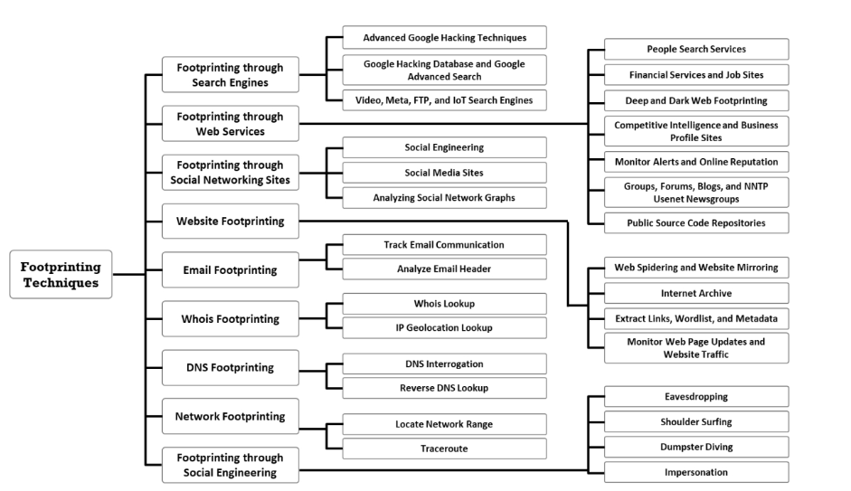

## 🧠 What is Footprinting?

Footprinting is the **first step in ethical hacking or cyberattack planning**, where the goal is to gather as much information as possible about a target.

### 🎯 Core Definition:
> Footprinting is the process of collecting **publicly available information** about a target system or organization to **identify potential vulnerabilities or entry points**.

Footprinting helps **assess the risk** associated with the data a company has exposed online and is used by attackers to build a blueprint of the target.

---

## 🧩 Types of Footprinting

| Type              | Description |
|-------------------|-------------|
| **Passive**       | Information is gathered **without directly interacting** with the target.   *Example: OSINT tools, social media, public databases.* |
| **Active**        | Information is gathered by **direct interaction** with the target systems.   *Example: DNS queries, ping sweeps, traceroutes, port scanning.* |

---

## 🔍 Information Collected During Footprinting

### 1. **Organizational Info**
- Company structure
- Employee names and job titles
- Phone numbers and addresses
- Subsidiaries and branches
- News articles, press releases

### 2. **Network Info**
- Domain names and subdomains
- IP ranges and network blocks
- DNS records and Whois data
- Firewalls, trusted routers
- Network topology

### 3. **System Info**
- Operating systems and web server details
- Email addresses and login portals
- Software versions and services in use

---

## 🎯 Objectives of Footprinting

- Gather info for **strategic attack planning**
- Identify **security infrastructure layout** (firewalls, proxies, IDS/IPS)
- Understand the **organization’s tech stack and weaknesses**
- **Develop a hacking roadmap** based on footprinting findings
- Evaluate how much **sensitive or critical information is publicly exposed**

---

## ⚠️ Footprinting Threats (CEH-Relevant Examples)

| Threat Type           | Description |
|------------------------|-------------|
| **Social Engineering** | Info like email formats or employee roles can help craft phishing attacks. |
| **Network Attacks**    | Recon data used for DDoS, MITM, or unauthorized access. |
| **Information Leakage**| Unintentional exposure of internal files, logs, or tech stack via public sources. |
| **Privacy Loss**       | Personal data of employees harvested from LinkedIn or breached datasets. |
| **Corporate Espionage**| Competitors may gather strategic insights using the same footprinting methods. |
| **Business Loss**      | Reputation damage, client trust loss, or regulatory penalties due to exposed weaknesses. |

---

✅ **Checkpoint:** You should now be able to:
- Explain the goal and methodology of footprinting.
- Differentiate between active and passive methods.
- Recognize common threats arising from poor security posture and excessive public exposure.
