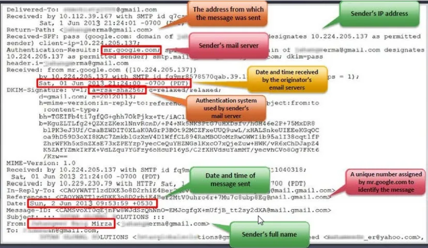

## 🎯 Objective
Email footprinting is used by attackers to **track email communications** and extract metadata such as IP address, geolocation, sender details, and message route.

---

## 📩 Tracking Email Communications

- Track delivery, open status, and recipient details
- Gather IP address, browser & OS details for reconnaissance
- Can be used in **social engineering** and **phishing attacks**

---

## 🧾 Collecting Information from Email Headers

### 🔍 What is an Email Header?
Email headers store metadata for each email transmission including routing details and origin information. It helps trace back the sender and infrastructure used.

### 📑 Header Information Includes:
- Sender’s mail server
- Date/time of email receipt and delivery
- Authentication method (e.g., SPF, DKIM)
- Sender’s full name
- Sender’s IP address
- Message ID (e.g., from `mx.google.com`)

### 💡 CEH Insight:
Attackers analyze this data to:
- Identify origin of emails
- Locate IPs
- Detect spoofing or relay paths
- Enumerate sender’s infrastructure

### 📧 Common Email Programs to Access Headers:
- eM Client  
- Mozilla Thunderbird  
- Outlook  
- Claws Mail  
- Hiri  
- Mailbird  
- Spike  
- SmarterMail Webmail

---

## 🔧 Email Tracking Tools

| Tool            | CEH-Relevant Use Case                                                                 |
|------------------|----------------------------------------------------------------------------------------|
| **eMailTrackerPro** | Analyzes headers, reveals sender's geolocation and mail server                      |
| **Infoga**          | Python tool used for gathering email information, domain scanning, and header review |
| **Mailtrack**       | Gmail plugin that shows if and when emails are opened                                |
| **PoliteMail**      | Outlook plugin that monitors open rate, location, and interaction                     |

---

## 🛡️ CEH Exam Focus
- Understand structure and fields of email headers
- Know tools used for header and tracking analysis (e.g., Infoga, eMailTrackerPro)
- Be able to explain how attackers can trace and exploit email metadata
- Know how to trace sender’s IP and email route using headers

---

