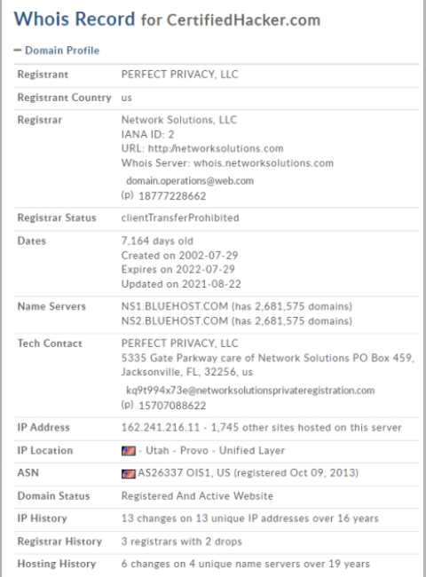

## 📌 Overview
WHOIS footprinting involves querying public WHOIS databases to retrieve registration details for a target domain, revealing personal and network-related information that can be used for social engineering and technical attacks.

---

## 🌐 Whois Lookup

- **WHOIS** is a query and response protocol used for querying databases that store registered users or assignees of domain names.
- **Port Used**: TCP 43
- **Maintained by**: Regional Internet Registries (RIRs)

### 🧱 WHOIS Data Models

| Type        | Description                                                                 |
|-------------|-----------------------------------------------------------------------------|
| **Thick**   | Stores **complete WHOIS records** (registrant + administrative + technical) |
| **Thin**    | Stores only **referral** to registrar's server (requires further querying)  |

---

## 📄 Information Retrieved from WHOIS

- Domain name and registrar
- Domain creation/expiry dates
- Name servers
- Administrative and technical contact info (names, addresses, emails, phone)
- NetRange (IP range)
- Last updated timestamp

---

## 🛠️ CEH Perspective: Why WHOIS Footprinting Matters

Attackers can:
- Extract **personal information** to craft social engineering attacks
- Identify **name servers** and IP ranges for technical scanning
- Build a **network topology** of the target organization
- Detect domain expiration for **domain hijacking** or **typo-squatting** opportunities

---

## 🌍 Regional Internet Registries (RIRs)

| RIR       | Region                         | URL                          |
|-----------|--------------------------------|-------------------------------|
| ARIN      | North America                  | https://www.arin.net         |
| AFRINIC   | Africa                         | https://www.afrinic.net      |
| APNIC     | Asia-Pacific                   | https://www.apnic.net        |
| RIPE NCC  | Europe, Middle East, Central Asia | https://www.ripe.net      |
| LACNIC    | Latin America & Caribbean      | https://www.lacnic.net       |

---

## 📍 IP Geolocation Footprinting

IP geolocation identifies the **physical location and ISP details** of the target. Useful in **geographical targeting attacks** like phishing or spamming.

### 🔍 What Can Be Identified?
- Country, State/Region, City
- Time Zone, ZIP Code
- ISP/Hosting Provider
- Mobile carrier, Area code
- Latitude, Longitude, Elevation

### 🛠️ Tools Used

| Tool             | Purpose                                                                 |
|------------------|-------------------------------------------------------------------------|
| **IP2Location**  | Retrieves IP-based location, ISP, and usage type                        |
| **IP Location Finder** | Maps IPs to cities and countries, useful for **OSINT** profiling     |
| **GeoIP (MaxMind)**   | Commercial-grade IP geolocation used by enterprise-grade tools       |

---

## ✅ CEH Exam Tips

- Understand the difference between **Thick** and **Thin WHOIS** models.
- Be familiar with **WHOIS lookup structure** and types of registrant info available.
- Learn the **real-world use cases** of WHOIS in **mapping networks** and **social engineering**.
- Memorize the names and regions of the 5 **RIRs**.
- Know how **IP Geolocation tools** can help in targeted attacks and enumeration.

---
