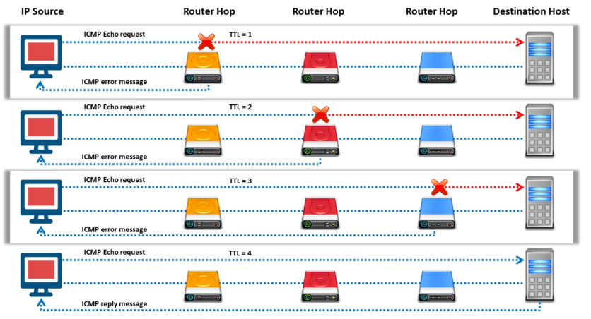

## 🧭 Objective
Network footprinting involves discovering a target's network topology, devices, and routing paths. This helps ethical hackers map the environment and identify potential vulnerabilities for later stages of penetration testing.

---

## 🌐 Locate the Network Range

- **Goal:** Identify the IP address range used by the target.
- **Purpose:** Helps build a network map and discover live hosts.
- **Method:** Use WHOIS and RIR databases.

### 🔍 Tools & Techniques
- **ARIN WHOIS**: Retrieve organization’s allocated IP blocks.
- **Regional Internet Registries (RIRs)**: 
  - [ARIN](https://www.arin.net) - North America
  - [RIPE NCC](https://www.ripe.net) - Europe
  - [APNIC](https://www.apnic.net) - Asia-Pacific
  - [LACNIC](https://www.lacnic.net) - Latin America
  - [AFRINIC](https://www.afrinic.net) - Africa

These allow you to identify **IP range**, **ASN**, and **CIDR blocks** assigned to organizations.

---

## 🚀 Traceroute

Traceroute is used to trace the path packets take from the attacker’s system to the target system. It reveals **intermediate routers**, **firewalls**, and **network hops**.

### 📌 Concept
- Uses **ICMP Echo packets** or **UDP packets** with increasing **TTL (Time-To-Live)**.
- Each hop returns an ICMP “Time Exceeded” message, revealing its IP.

---

## 🧠 Traceroute Analysis Example

Attackers run traceroute commands to identify intermediate IPs:
```bash
traceroute 1.10.10.20
  - Second-to-last hop: 1.10.10.1
traceroute 1.10.20.10
  - Third-to-last hop: 1.10.10.1
  - Second-to-last hop: 1.10.10.50
```
By analyzing patterns across multiple traces, an attacker identifies:
- Internal routers
- Firewall locations
- Possible segmentation boundaries



---

## 🛠️ Traceroute Tools (CEH Perspective)
| Tool                  | CEH-Relevant Features                                                            |
| --------------------- | -------------------------------------------------------------------------------- |
| **Path Analyzer Pro** | Combines traceroute with WHOIS, DNS resolution, and network stats                |
| **VisualRoute**       | Maps IPs with geolocation and shows real-time route diagnostics                  |
| **Traceroute NG**     | Next-gen traceroute from SolarWinds; includes TCP, ICMP, and latency measurement |
| **PingPlotter**       | Continuous traceroute visualization with packet loss and latency heatmaps        |

---

## ✅ CEH Exam Tips
- Know how **TTL** and **ICMP** are used in traceroute.
- Understand how to interpret **routing paths** and detect **firewalls or NAT devices**.
- Be familiar with **network mapping tools** and **how traceroute contributes to footprinting.**
- Memorize **RIRs** and the purpose of WHOIS in discovering network ranges.


